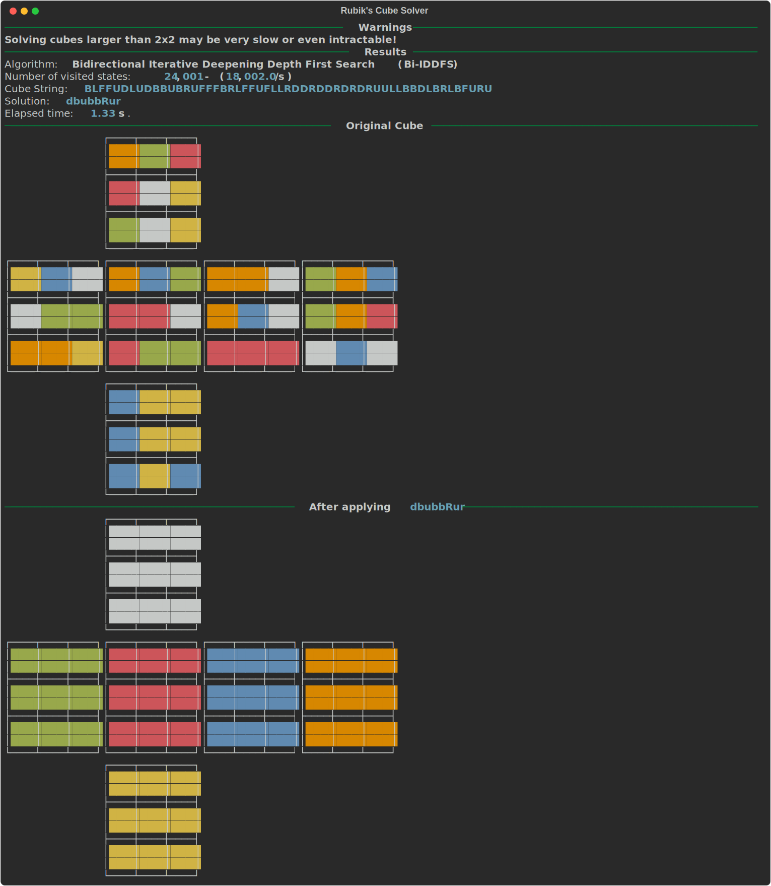
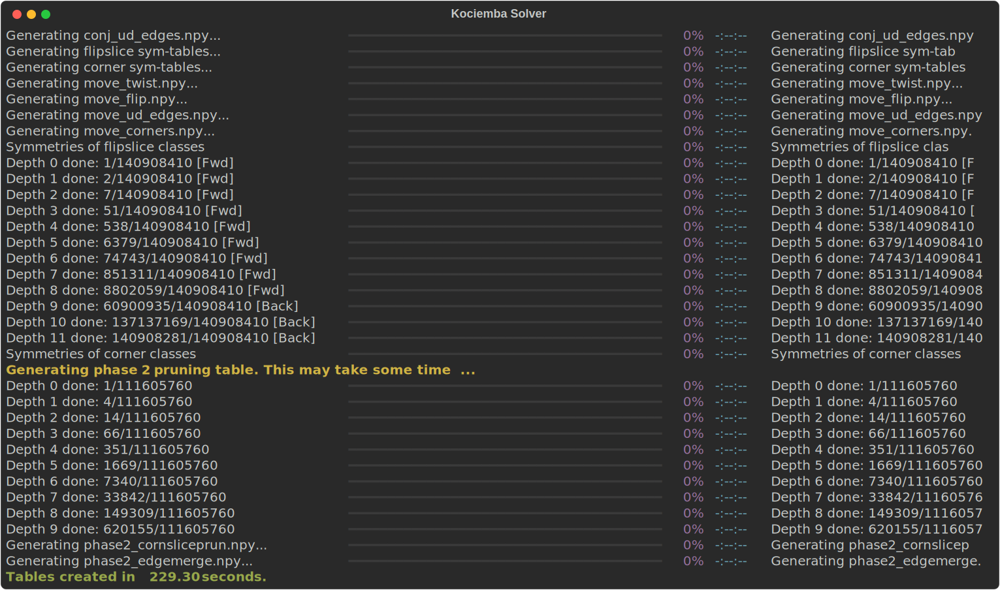
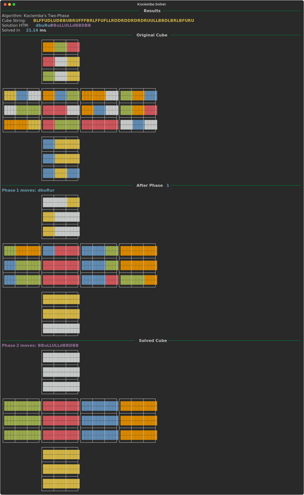

# Magic Cube

> A collection of algorithms for solving 2x2 and 3x3 Rubik's Cubes, including a vectorized implementation of Kociemba's two-phase algorithm.

## Video

[](https://www.youtube.com/watch?v=VkjU6YZQbUw)

## Installation

I am using [uv](https://docs.astral.sh/uv/getting-started/installation/) but you can use any Python environment of your choice.

```bash
git clone https://github.com/twaclaw/rubik.git
cd rubik
uv venv --python=3.13
source .venv/bin/activate
uv install -e .
```

## Standard search algorithms

These algorithms can be invoked using the `rubik` command line tool and can be used to solve  2x2 cubes. They can also solve instances of the 3x3 cube that are not overly scrambled (i.e., $n\le 10$). These algorithms are generally intractable for very scrambled 3x3 cubes. See `rubik --help` for a complete list of options.

The following algorithms are implemented and can be passed as an argument to the `-a` (`--algorithm`) option, for example `rubik -a bi-bfs`.

- Uninformed-search algorithms:
  - `bfs`$\to$[Breadth-First Search](./src/rubik/bfs.py)
  - `iddfs`$\to$[Iterative Deepening Depth-First Search](./src/rubik/ids.py)
- Meet-in-the-middle algorithms:
  - `bi-bfs`$\to$[Bidirectional Breadth-First Search](./src/rubik/bi_bfs.py)
  - `bi-iddfs`$\to$[Bidirectional Iterative Deepening Depth-First Search](./src/rubik/bi_ids.py)

### Examples

```bash
# Solve a 2x2 cube that has been randomized with five scrambles using IDDFS.
rubik  -a iddfs -n 5 -s 2

# Solve a specific 2x2 cube (defined by a string) using BFS
rubik -c BDBULRLRDBUBFDFURRLLFUFD -a bfs -s 2

# Solved a specific 3x3 cube using Bi-IDDFS
rubik  -a bi-iddfs -c BLFFUDLUDBBUBRUFFFBRLFFUFLLRDDRDDRDRDRUULLBBDLBRLBFURU -s 3
```

<details>
<summary>📊 <i>Click to expand: Output for the last command above</i></summary>



</details>

## Kociemba's Two-Phase Algorithm

If there's anything more beautiful than an elegant algorithm, it's an elegant algorithm inspired by mathematics. Herbert Kociemba's [two-phase algorithm](https://kociemba.org/) is beautiful, elegant, and efficient.

The `kociemba` command-line tool implements Kociemba's algorithm. My implementation is a Numpy vectorized port of his original [Python implementation](https://github.com/hkociemba/RubiksCube-TwophaseSolver). See [src/rubik/kociemba](./src/rubik/kociemba/README.md) for a complete list of the changes I made.

### Examples

```bash
# Create the tables needed by the algorithm (only once)
kociemba --verbose --create-tables --path ./tables
```

<details>
<summary>📊 <i>Click to expand: Output of the previous table generation</i></summary>



</details>

---

```bash
# Solve a random 3x3 cube scrambled with 20 random moves
kociemba solve -n 20

# Solve a specific cube defined by a string
kociemba solve -c BLFFUDLUDBBUBRUFFFBRLFFUFLLRDDRDDRDRDRUULLBBDLBRLBFURU
```

<details>
<summary>📊 <i>Click to expand: Output of the last command above</i></summary>



</details>

---

Finally, if you specify the `--video`, `--gif` or `--image` options, a video (like the one above), GIF or image will be generated using [Manim](https://www.manim.community/).

```bash
kociemba solve -c BLFFUDLUDBBUBRUFFFBRLFFUFLLRDDRDDRDRDRUULLBBDLBRLBFURU --video --image
```

# Credits and Further Reading

- [Kociemba's home page](https://kociemba.org/)
- [Kociemba's GitHub](https://github.com/hkociemba)
- [cube20.org](https://cube20.org/)
- The code for the video rendering/3d animation was adapted from [WampyCakes/manim-rubikscube](https://github.com/WampyCakes/manim-rubikscube).
